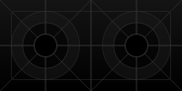
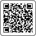

# UDP Touchpad
The UDP touchpad is an android app that evaluates multi-touch events, for example from a smartphone, and sends them to a multicast group via UDP.
Sensor data from motion sensors (acceleration, rotation rate, rotation vector) is also sent.
A 2-by-1 grid is displayed on the screen of the android device, which is fitted to the entire screen size.
The UDP Touchpad can handle up to 10 multitouch events.

# Download
[Download](https://raw.githubusercontent.com/RobertDamerius/UDPTouchpad/main/android/app/release/app-release.apk) the app from this repository.
The ``.apk`` file is located in the [android/app/release](android/app/release/) directory.

> **Note** 
> In order to install the app on the smartphone, permissions may need to be adjusted to allow apps from unknown sources to be installed.

## Message Protocol

| UDP/IP PROPERTY     | VALUE                                    |
| :-------------------| :--------------------------------------- |
| Source Port         | random, selected by device               |
| Destination Port    | 10891                                    |
| Destination Address | 239.192.82.74                            |
| Multicast TTL       | 1                                        |
| Message Length      | 136                                      |
| Endianness          | Big-endian                               |
| Update Rate         | 20 ms and whenever a touch event appears |

**Binary Message Format**

| Byte Offset | Datatype       | Name                 | Description |
| :---------- | :------------- | :------------------- | :---------- |
| 0           | ``uint8``      | ``header``           | Must be ``0x42``. |
| 1           | ``uint8``      | ``counter``          | Counter that is incremented with each new message sent. |
| 2           | ``uint32``     | ``screenWidth``      | Width of the device screen in pixels. |
| 6           | ``uint32``     | ``screenHeight``     | Height of the device screen in pixels. |
| 10          | 10 x ``uint8`` | ``pointerID``        | ID of the pointer that touches the screen or ``0xFF`` if a pointer is not present. |
| 20          | 20 x ``float`` | ``pointerPosition``  | 2D position for each pointer in pixels or zero if the corresponding pointer is not present. The order is ``x0, y0, x1, y1, ... , x9, y9`` |
| 100         | 3 x ``float``  | ``rotationVector``   | Latest 3D rotation vector sensor data from an onboard motion sensor. If no motion sensor is available, all three values are ``NaN``. |
| 112         | 3 x ``float``  | ``acceleration``     | Latest 3D accelerometer sensor data from an onboard motion sensor in m/s^2. If no motion sensor is available, all three values are ``NaN``. |
| 124         | 3 x ``float``  | ``angularRate``      | Latest 3D gyroscope sensor data from an onboard motion sensor in rad/s. If no motion sensor is available, all three values are ``NaN``. |
